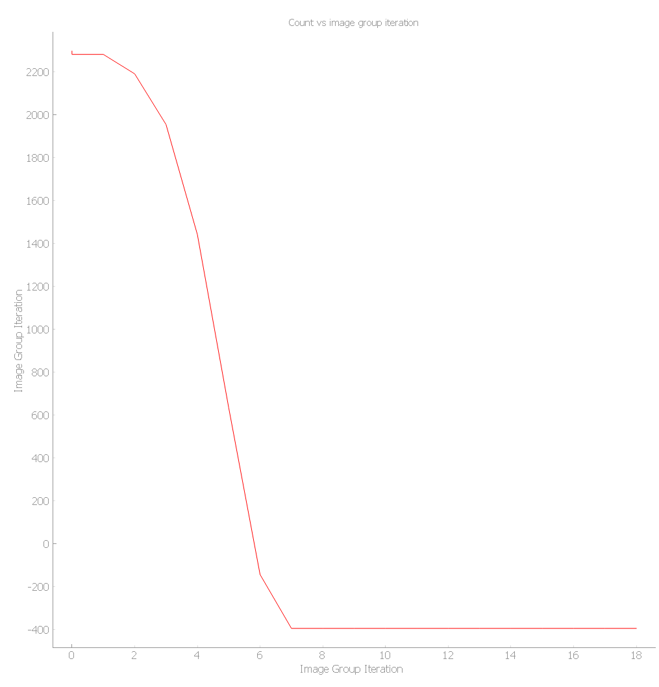
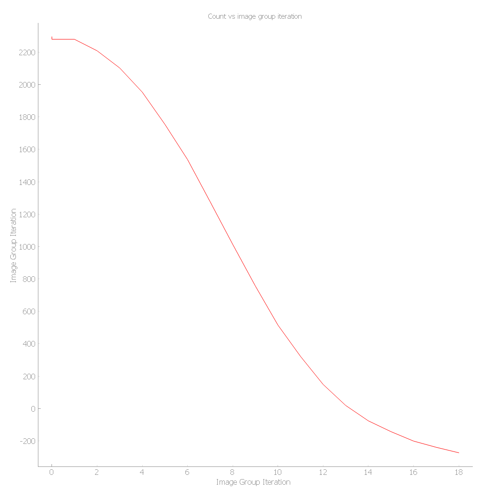

### Project description
This version of the optimization algorithm utilizes momentum gradient descent such that instead of the usual gradient descent: 

$$W_{n+1}=W_{n}-\gamma \nabla f(W_{n})$$

By adding a 'momentum' term, we arrive at the modified expression:

$$W_{n+1}=W_{n}+\beta(W_{n}-W_{n-1})-\gamma \nabla f(W_{n})$$

Where $\gamma$ is the learning rate as previously seen in the classic gradient descent algorithm, and $\beta$ is the new momentum constant. 

In python code this mathematical formula takes on the following form:
```python
self.new_focus = self.focus_history[-1] + (self.momentum*(self.focus_history[-1]-(self.focus_history[-2])) - self.focus_learning_rate*self.count_focus_der[-1]
```

This upgrade promises to help the optimization:
- Take less step until optimization
- Avoid getting stuck in local maximum points

### Faster optimization

<div class="row" style="content: ''; clear: both; display: table; margin: 0 auto;">
  <div class="column" style="float: left; width: 33.33%; padding: 5px;">
    <h3 style="text-align: center;">Momentum Gradient Descent</h3>
    
  </div>
  <div class="column" style="float: left; width: 33.33%; padding: 5px;">
    <h3 style="text-align: center;">Vanilla Gradient Descentt</h3>
    
  </div>
</div>


Unlike classic gradient descent, momentum gradient descent takes less sharp turns. Essentially, where gradient descent depend on the previous gradient, momentum gradient descent incorporates a moving average of past gradients, allowing it to smooth out variations in the optimization.

### Absolute optimization
In order to test the promise of momentum gradient descent to find the absolute maximum and minimum points, I tested using the following function:
$$C(f,\phi_{2})=(0.1(f+\phi_{2}))^{2}\cdot \sin(0.01(f+\phi_{2}))$$
When plotting it we see it takes on the form:
<br>
<div align="center">

</div>

Focusing on the region near zero, I get the following optimization test region with a local and 'absolute' minimum points.
<br>
<div align="center">

</div>

I will initialize the algorithm at the red point as seen above. Where a classic gradient descent will get stuck in the local minimum, the momentum gradient descent will be able to optimize to the greater 'absolute' minimum surpassing the local minimum and saddle point.

Now, running the algorithm as seen in `momentum_main.py` I will verify my assumptions. 

Using vanilla gradient descent ($\beta=0$), we arrive at the local minimum point as expected:
<br>
<div align="center">

</div>

Using momentum gradient we arrive at the greater minimum point:
<br>
<div align="center">

</div>

As shown, the algorithm was able to get to the global minimum. Mission complete? Not exactly. The system is sensitive to the learning rates and momentum constants and will not always arrive to the optimal solution.

### Additional code updates

My changes include:
- Breaking up the repetitive code to functions 
- Implementing more `numpy` alternatives for faster computation

The code now utilizes `numpy` arrays as an alternative for python lists for faster computation.

```python
        self.third_dispersion_der_history = np.array([])
        self.second_dispersion_der_history = np.array([])
        self.focus_der_history = np.array([])
        self.total_gradient_history = np.array([])
```


For better organization in the function `process_images()`, I broke up the code into two functions.

```python
    def write_value(self):
        self.new_focus = int(round(np.clip(self.new_focus, self.FOCUS_LOWER_BOUND, self.FOCUS_UPPER_BOUND)))
        self.new_second_dispersion = int(round(np.clip(self.new_second_dispersion, self.SECOND_DISPERSION_LOWER_BOUND, self.SECOND_DISPERSION_UPPER_BOUND)))
        self.new_third_dispersion = int(round(np.clip(self.new_third_dispersion, self.THIRD_DISPERSION_LOWER_BOUND, self.THIRD_DISPERSION_UPPER_BOUND)))
        self.focus_history = np.append(self.focus_history, [self.new_focus])
        self.second_dispersion_history = np.append(self.second_dispersion_history, [self.new_second_dispersion])
        self.third_dispersion_history = np.append(self.third_dispersion_history, [self.new_third_dispersion])

        mirror_values[0] = self.new_focus
        dispersion_values[0] = self.new_second_dispersion
        dispersion_values[1] = self.new_third_dispersion

        with open(MIRROR_FILE_PATH, 'w') as file:
            file.write(' '.join(map(str, mirror_values)))
        with open(DISPERSION_FILE_PATH, 'w') as file:
            file.write(f'order2 = {dispersion_values[0]}\n')
            file.write(f'order3 = {dispersion_values[1]}\n')
        self.upload_files() # send files to second computer
        QtCore.QCoreApplication.processEvents()
```

```python
    def plot_reset(self):
        self.plot_curve.setData(self.iteration_data, self.count_history)
        self.focus_curve.setData(self.der_iteration_data, self.focus_der_history)
        self.second_dispersion_curve.setData(self.der_iteration_data, self.second_dispersion_der_history)
        self.third_dispersion_curve.setData(self.der_iteration_data, self.third_dispersion_der_history)
        self.total_gradient_curve.setData(self.der_iteration_data, self.total_gradient_history)

        self.n_images_count_sum = 0
        self.mean_count_per_n_images  = 0
        img_mean_count = 0
```

Using these, the `process_images()` function takes on the following form:

```python
    def process_images(self):
        self.images_processed += 1
        self.iteration_data.append(self.images_processed)

        if self.images_processed == 1:
                   
            self.focus_history.append(self.initial_focus)                       
            self.second_dispersion_history.append(self.initial_second_dispersion)

            self.count_function(self.focus_history[-1], self.second_dispersion_history[-1])   
            self.calc_derivatives()
                        
            print(f"initial focus = {self.focus_history[-1]}, initial second dispersion = {self.second_dispersion_history[-1]}")

        elif self.images_processed == 2:
            self.new_focus = self.focus_history[-1] +1
            self.new_second_dispersion =  self.second_dispersion_history[-1] +1

            self.focus_history.append(self.new_focus)
            self.second_dispersion_history.append(self.new_second_dispersion)

            self.count_function(self.focus_history[-1], self.second_dispersion_history[-1])   
            self.calc_derivatives()

            print(f"function_value {self.count_history[-1]}, current values are: focus {self.focus_history[-1]}, second_dispersion {self.second_dispersion_history[-1]}")

        else:
   
            self.der_images_processed += 1             
            self.count_function(self.focus_history[-1], self.second_dispersion_history[-1])   
            self.optimize_count()

            print(f"function_value {self.count_history[-1]}, current values are: focus {self.focus_history[-1]}, second_dispersion {self.second_dispersion_history[-1]}")

        QtCore.QCoreApplication.processEvents()

        # update the plots
        self.plot_curve.setData(self.der_iteration_data, self.count_history)
        self.total_gradient_curve.setData(self.der_iteration_data, self.total_gradient_history)
        
        # reset variables for next optimization round
        self.image_group_count_sum = 0
        self.mean_count_per_image_group  = 0
        self.img_mean_count = 0  
        print('-------------')        
```
